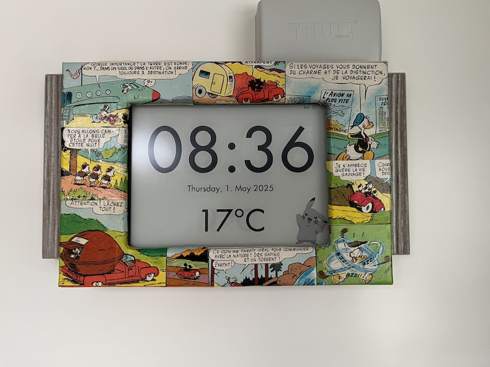

# Kindle Dashboard

My own fork of [kindle-clock](https://github.com/mattzzw/kindle-clock), supporting Kindle Paperwhite 6th generation.

Customized for my own usage, use at your own risk!

Kindle must be jailbroken for this to work. And KUAL installed.

Two menu entries are available:

 - Clock: for offline usage, just a clock refreshing every minute, and the Kindle internal temperature
 - Weather: when wifi is available, act as a clock too, but fetches weather forecasts every hour

